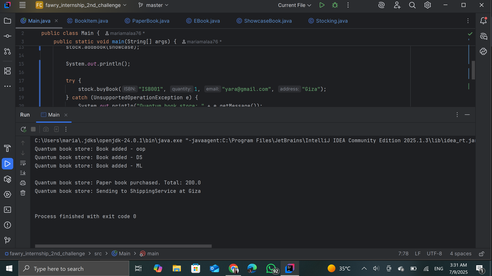

# Quantum Bookstore 🛍️📚

This is a Java console-based simulation of an online bookstore with three types of books:
- **PaperBook**: Physical books with stock and shipping.
- **EBook**: Digital books with file type, sent via email.
- **ShowcaseBook**: Display-only books, not for sale.

---

## 💡 Features

- Add books to inventory
- Buy books by ISBN (with validation)
- Remove outdated books based on year
- Extensible design using OOP (easily add new book types)

---


## 🖼️ Screenshots


1. Clone the repo:
```bash
git https://github.com/mariamalaa76/fawry_internship_2nd_challenge
